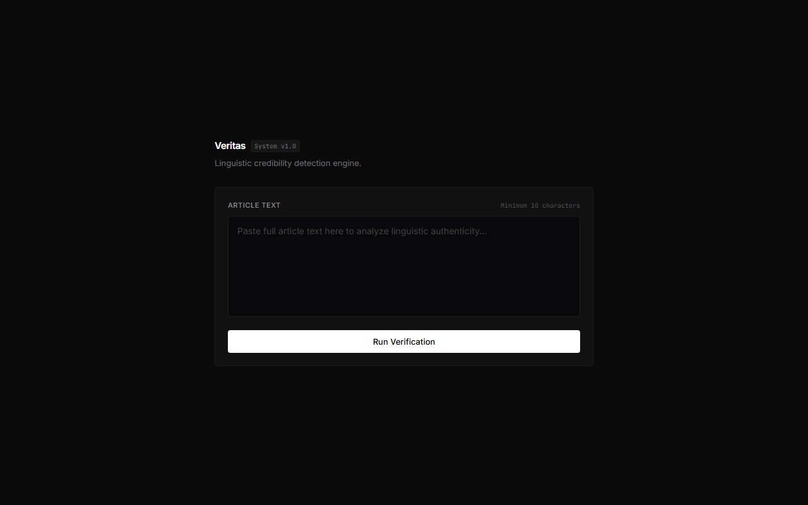
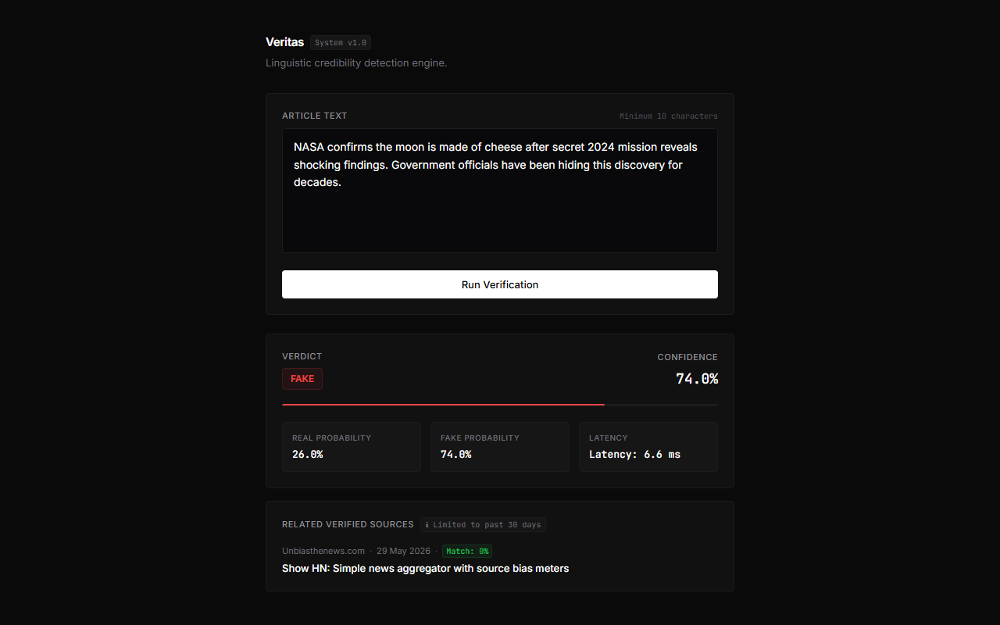
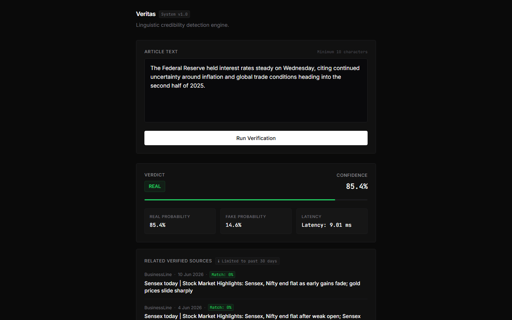
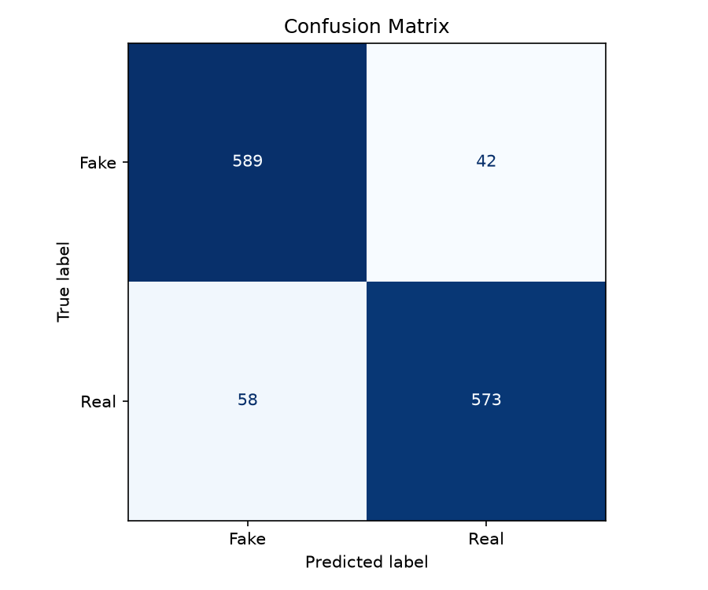
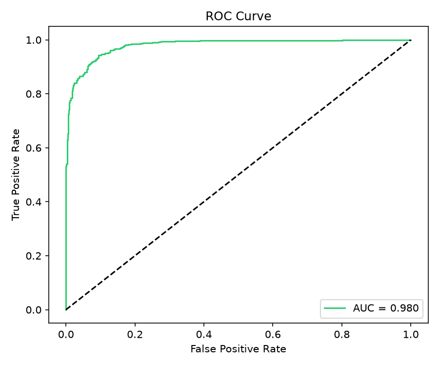

# Fake News Detector


This application classifies news articles as either real or fake based on their linguistic style and verifies their claims against live news directories. It is designed for researchers and developers who want to check the credibility of text inputs. Instead of just running an isolated offline machine learning model, it incorporates real-time news source verification by matching the inputs to live articles published in mainstream media.

## Demo


The empty home screen console where the user pastes text for evaluation.


Analysis of a fake news article showing class probabilities, latency, and a verified source search result showing no matches.


Analysis of a real news article showing high credibility and matching verified articles from trusted sources.

## How it works

The machine learning pipeline starts by converting raw article texts into lowercase, stripping URLs, HTML tags, digits, and punctuation. The text is tokenized into individual words, stop words are removed, and the remaining tokens are lemmatized. I used a TF-IDF vectorizer configured to extract unigrams and bigrams up to a maximum of 20,000 features. A Logistic Regression classifier takes these feature vectors to compute probability scores. I chose Logistic Regression over heavier tree-based models or deep neural networks because it trains in seconds, runs predictions in milliseconds, and provides high interpretability through feature coefficients.

To provide real-world context, the application triggers a parallel search after each prediction. It extracts the first ten words of the input article and queries the NewsAPI database, searching both top headlines and historical indexes. The verification layer merges these search results, filters out duplicates, and ranks the articles by calculating a keyword overlap score between the search query and the returned titles. If matching verified articles are found, they are presented with direct links, helping users cross-reference the claim with established sources.

## Performance

| Metric | Value |
| --- | --- |
| Test Accuracy | 91.0% |
| CV Mean F1 | 0.9135 |
| ROC-AUC | 0.9799 |
| Inference Latency | 6.71 ms |
| Training Dataset | 49,251 articles |

The mean F1-score dropped from 0.92 to 0.91 when I expanded the dataset because the LIAR dataset contains short, sparse statements that lack the rich context and vocabulary found in the full-length articles of the Kaggle dataset.

## Evaluation Plots


Confusion matrix showing the class-level classification breakdown on the test set.


Receiver Operating Characteristic (ROC) curve showing the true positive rate versus the false positive rate, resulting in a 0.9799 area under the curve.

The confusion matrix illustrates the balance of prediction errors between the FAKE and REAL classes. With a highly balanced test split, the model maintains a low rate of false positives and false negatives, indicating stable performance across both domains. The ROC curve further validates this class separation, showing a steep climb toward the top-left corner and achieving a 0.9799 area under the curve (ROC-AUC). This high AUC metric demonstrates that the model is highly effective at separating the two classes under varying classification thresholds.

## Tech Stack

ML: Python, Scikit-Learn, NLTK, TF-IDF, Logistic Regression

API: FastAPI, httpx, slowapi, python-dotenv

Frontend: Pure HTML/CSS, Inter font, vanilla JS

Infrastructure: Docker, Docker Compose

## Getting Started

1. Clone the repository and navigate to the project directory:
```bash
git clone https://github.com/your-username/fake-news-detector.git
cd fake-news-detector
```

2. Set up a virtual environment and install the required packages:
```bash
python -m venv .venv
.venv/Scripts/activate
pip install -r requirements.txt
```

3. Register for a free API key at https://newsapi.org/register to obtain your credentials.

4. Create a `.env` file in the root directory and add your NewsAPI key:
```env
NEWS_API_KEY=your_newsapi_key_here
```

5. Run the dataset expansion script to download and prepare the training data:
```bash
python src/expand_dataset.py
```

6. Train the machine learning pipeline and save the model:
```bash
python src/train.py
```

7. Start the FastAPI application server:
```bash
uvicorn api.main:app --port 8000
```

8. Open your browser and navigate to http://127.0.0.1:8000 to use the application.

## API Reference

| Method | Endpoint | Description |
| --- | --- | --- |
| POST | /predict | Classify article as FAKE or REAL |
| GET | /verify?query= | Fetch related verified news sources |
| GET | /health | Service health check |

Here is a curl command to test the prediction endpoint:
```bash
curl -X POST "http://127.0.0.1:8000/predict" -H "Content-Type: application/json" -d "{\"text\": \"The Federal Reserve held interest rates steady on Wednesday, citing continued uncertainty around inflation and global trade conditions.\"}"
```

Here is a curl command to test the news verification endpoint:
```bash
curl "http://127.0.0.1:8000/verify?query=federal+reserve+interest+rates"
```

## Project Structure

```text
Fakenewsdetection/
├── api/
│   ├── __init__.py
│   ├── main.py       # FastAPI application and route handlers
│   └── schemas.py    # Pydantic request and response schemas
├── data/
│   ├── processed/
│   │   └── cleaned.csv # Combined and balanced dataset
│   └── raw/
│       ├── Fake.csv
│       ├── True.csv
│       └── liar/     # Folder containing the LIAR dataset TSVs
├── docs/
│   ├── confusion_matrix.png
│   ├── roc_curve.png
│   └── screenshots/  # App screenshots embedded in this README
├── frontend/
│   ├── app.js        # Client-side API request orchestration
│   ├── index.html    # Minimalist console-style user interface
│   └── style.css     # CSS rules for dark console aesthetics
├── models/
│   └── pipeline.pkl  # Serialized scikit-learn model pipeline
├── notebooks/        # Jupyter notebooks for data analysis
├── src/
│   ├── __init__.py
│   ├── evaluate.py   # Computes test metrics and outputs docs/ plots
│   ├── expand_dataset.py # Handles dataset downloads, cleaning, and merges
│   ├── features.py   # Configures TF-IDF and scikit-learn pipeline
│   ├── preprocessing.py # Text tokenization and lemmatization pipeline
│   └── train.py      # Trains classifier and exports model pipeline
├── .env.example
├── .gitignore
├── Dockerfile
├── docker-compose.yml
└── requirements.txt
```

## Model Notes

I chose a Logistic Regression classifier because it scales efficiently, trains in under a minute, and provides a clear mapping of feature weights. When we expand the dataset by adding the LIAR statements, the overall F1-score decreases due to the document length mismatch between short statements and long articles. The next structural upgrade for this project would be replacing the TF-IDF feature extractor with a pre-trained transformer model like DistilBERT to capture contextual meaning rather than word frequencies.

## License

MIT License
